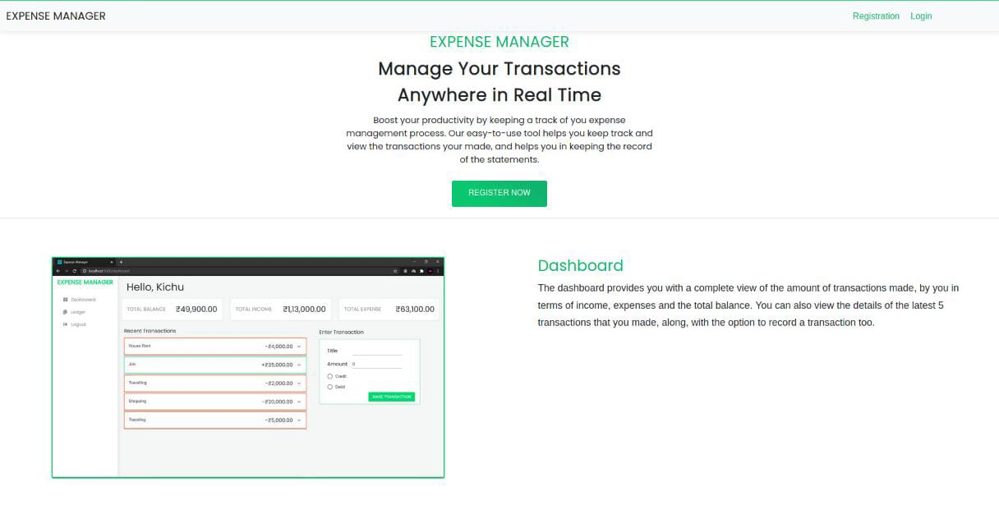

# ExpenseManager

This Repository is contain the Source code of the __Expense Manager__

You can see the website [HERE](https://expense-manager-manish-soumitha.netlify.app)

### Introduction (Project Aim)

This website help the users to check their account statement and can access any expense and income of any date. The Project Collaboration of 

[Soumitha](https://github.com/soumitha18) and
[Manish Kumar](https://github.com/Manish-kumar-DEV)

### Technologies

- HTML
- CSS
- material-ui
- React
- MongoDB

### Features

- Account
  - Registration
  - Login
  - Logout
- Dashboard
  - Enter the Transations
  - latest 5 Transactions
  - Income
  - Expenses
  - Balance
- Ledger
  - All transactions (20 perPage)
  
### Yet to implement

- Edit the Transaction detail (in Dashboard)
